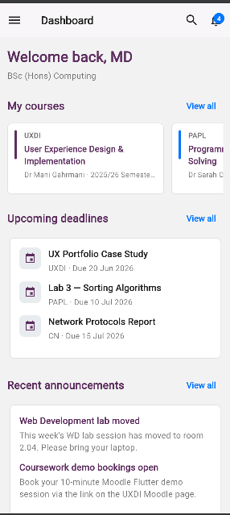
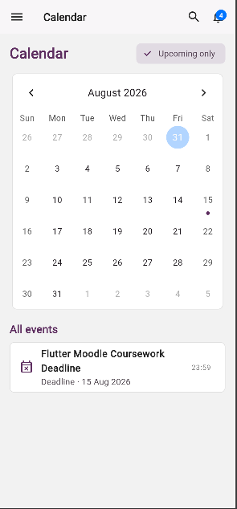

# Moodle Learning Management System App

A Flutter-based responsive Moodle Learning Management System (LMS) client developed as part of an undergraduate Software Engineering coursework. The application recreates key Moodle features using Flutter, Provider, GoRouter, and Firebase Authentication.

## Table of Contents
- [Overview](#overview)
- [key features](#key-features)
- [Screenshots](#screenshots)
- [Detailed Features](#detailed-features)
  - [Basic Tier](#basic-tier)
  - [Intermediate Tier](#intermediate-tier)
  - [Advanced Tier](#advanced-tier)
- [Tech Stack](#tech-stack)
- [Folder Structure](#folder-structure)
- [Setup and Installation](#setup-and-installation)
- [Known Limitations](#known-limitations)

---

## Overview
This application provides a responsive interface for students to access course materials, submit assignments, view calendar deadlines, receive notifications, search across LMS resources, and manage user profiles.

---
## Key Features

- Responsive Flutter Web application
- Firebase Authentication (Google + Email/Password)
- Global Search
- Provider State Management
- GoRouter Navigation
- Assignment Submission
- Interactive Calendar
- Notifications Panel
- Responsive Desktop & Mobile Layout
---

## Screenshots

| Login Page | Dashboard View |
| :---: | :---: |
|  |  |

| My Courses | Assessment Page |
| :---: | :---: |
|  |  |

| Calendar View | Notifications Panel |
| :---: | :---: |
|  |  |

---

## Detailed Features

### Basic Tier
- **Dashboard View**: Overview of enrolled courses, upcoming assignments, and recent activity updates.
- **App Bar & Navigation Drawer**: Header with app title, global search button, unread notification counter badge, and sliding drawer navigation.
- **Static Page Interfaces**: UI views for user profile, enrolled courses, assessments list, calendar, and authentication pages.

### Intermediate Tier
- **Declarative Navigation**: Route configuration using `go_router` with URL parameter parsing (`/courses/:id`, `/assignments/:id`).
- **Provider State Management**: Centralized state management using `ChangeNotifierProvider` (`CourseProvider`, `AssignmentProvider`, `NotificationProvider`, `CalendarProvider`).
- **Dynamic Courses Page**: Search courses by code or title, filter by academic term, and toggle favorite courses.
- **Course Details View**: Accordion layout with collapsible course topics and resource links.
- **Assignment Submission**: Assignment status tracking and interactive file upload / text submission flow.
- **Interactive Calendar**: Event deadlines organized by date using `table_calendar` with day filtering.
- **Notifications Panel**: Slide-out end drawer displaying course announcements and read/unread status tracking.
- **Global Multi-Provider Search**: Real-time simultaneous search querying courses, assessments, and announcements with grouped results.
- **Responsive Layout**: Adaptive layout shell (`MoodleScaffold`) supporting desktop side-rail (`>900px`) and mobile sliding drawer.

### Advanced Tier
- **Firebase Authentication**: Email and password authentication alongside Google Sign-In integration.
- **Route Guards**: Dynamic redirection ensuring unauthenticated users are redirected to login/registration routes.
- **Live User Profile**: Display of authenticated Firebase user details including display name, email address, and profile photo URL.

---

## Tech Stack
- **Framework**: [Flutter](https://flutter.dev) (Dart SDK `>=2.17.0 <4.0.0`)
- **State Management**: [Provider](https://pub.dev/packages/provider) (`^6.1.2`)
- **Routing**: [go_router](https://pub.dev/packages/go_router) (`^14.6.2`)
- **Authentication**: [firebase_core](https://pub.dev/packages/firebase_core) (`^4.12.1`), [firebase_auth](https://pub.dev/packages/firebase_auth) (`^6.5.6`), [google_sign_in](https://pub.dev/packages/google_sign_in) (`^7.2.0`)
- **Calendar**: [table_calendar](https://pub.dev/packages/table_calendar) (`^3.1.2`)
- **File Uploads**: [file_picker](https://pub.dev/packages/file_picker) (`^8.1.4`)

---

## Folder Structure
```
lib/
├── constants.dart            # Design tokens, color palette, and layout breakpoints
├── firebase_options.dart     # Firebase platform configurations
├── main.dart                 # Application entry point & MultiProvider setup
├── routes.dart               # GoRouter paths and auth redirect guards
├── data/
│   └── dummy_data.dart       # Mock dataset for courses, assignments, and announcements
├── models/
│   ├── announcement.dart     # Announcement data model
│   ├── assignment.dart       # Assignment and status enum models
│   ├── calendar_event.dart   # Calendar event model
│   └── course.dart           # Course and Topic data models
├── providers/
│   ├── assignment_provider.dart    # Assignment state and submission logic
│   ├── auth_provider.dart          # Firebase auth state & stream subscription
│   ├── calendar_provider.dart      # Selected date and calendar event state
│   ├── course_provider.dart        # Course search, term filtering, and favorites
│   └── notification_provider.dart  # Announcement list and unread count tracking
├── services/
│   ├── announcement_service.dart   # Announcement data fetching service
│   ├── assignment_service.dart     # Assignment data service
│   ├── auth_service.dart           # FirebaseAuth & GoogleSignIn implementation
│   ├── course_service.dart         # Course data service
│   └── notification_service.dart   # Notification data service
├── views/
│   ├── assessments_view.dart       # Filtered assignment list view
│   ├── assignment_detail_view.dart # Assignment detail and submission view
│   ├── calendar_view.dart          # Interactive calendar view
│   ├── course_details_view.dart    # Course topics and resources accordion
│   ├── courses_view.dart           # Searchable courses grid view
│   ├── dashboard_view.dart         # Main overview dashboard
│   ├── global_search_view.dart     # Multi-provider grouped global search
│   ├── login_view.dart             # Login screen (Email/Password & Google)
│   ├── notifications_view.dart     # Dedicated notifications list page
│   ├── profile_view.dart           # Firebase user profile view
│   └── register_view.dart          # Account creation view
└── widgets/
    ├── app_bar_widget.dart         # Standard Moodle app bar header
    ├── assignment_tile.dart        # Reusable assignment list item
    ├── course_card.dart            # Reusable course card
    ├── moodle_scaffold.dart        # Responsive layout shell (side-rail vs drawer)
    ├── nav_drawer.dart             # Drawer and sidebar navigation widgets
    └── notification_panel.dart     # End drawer notification panel
```

---

## Setup and Installation

### Prerequisites
- [Flutter SDK](https://docs.flutter.dev/get-started/install) installed (`>=2.17.0`)
- Google Chrome (or desktop platform target)

### Steps
1. Install project dependencies:
   ```bash
   flutter pub get
   ```

2. (Optional) Reconfigure Firebase settings if using a custom project:
   ```bash
   flutterfire configure
   ```

3. Run the application in Chrome:
   ```bash
   flutter pub get

   flutter analyze

   flutter test

   flutter run -d chrome
   ```

---

## Known Limitations
- **Data Persistence**: Course data, topic resources, and assignment submission grades are managed in-memory via Provider state initialized from mock data.
- **Backend Database**: Cloud Firestore / Remote DB synchronization is omitted in favor of local Provider state for coursework scope.
- **File Storage Cloud Upload**: Assignment file attachments use `file_picker` to validate local file selection without persisting files to remote cloud storage buckets.
